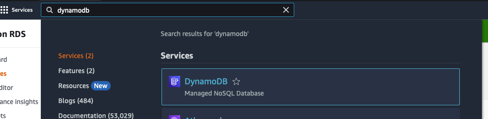
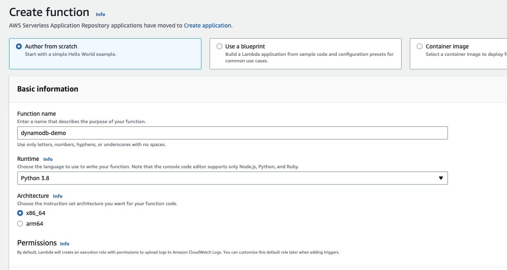

# DynamoDB Lab instructions

## Description

This lab will cover:

- Creating the following resources in an AWS account:

  - S3 Bucket

  - Lambda function

  - DynamoDB table

- How to integrate the services together

## Pre-requisites

- Access to an AWS Account

- Optionally, AWS CLI installed and configured

## Steps

Create a S3 Bucket with the defaults

```bash
aws s3 mb s3://{MY_BUCKET} --region  us-east-1

# output: 
make_bucket: {MY_BUCKET}
```

Create a DynamoDB Table

- Navigate to the DynamoDB console 

- Click on __Create table__ under _Get Started_ section 

- Set the following settings

  - __Table name__ = wizeworkshop3

  - __Partition Key__ = ‘key_name’

  - __Sort Key__ = ‘bucket_name’

  - __Table settings__ = Customize settings

  - __Table class__ = DynamoDB Standard

  - __Read/write capacity settings__ = Capacity mode: On-demand

  -  

  - Leave the rest of the configurations by default and click on __Create table__

Create a Lambda function

- Navigate to lambda console 

- Click on __create function__, select __Author from scratch__ and type a name for it 

- Set the runtime to __Python 3.8__.

- Unfold the __Change default execution role__ section and choose __Create a new role from AWS policy templates__.

- Type a name and select the __Simple microservice permissions__ policy template

- 

- Click on __Create function__.

- You will see an online editor, with some sample Python code. Paste the next block on the lambda function (replace the default one)

```python

import os
import boto3
from botocore.exceptions import ClientError
import datetime as dt
import json

AWS_REGION = os.environ['AWS_REGION']
DYNAMODB_TABLE = 'wizeworkshop3'

def register_put(bucket_name, key_name, dynamodb=None):
    if not dynamodb:
        dynamodb = boto3.resource('dynamodb', region_name=AWS_REGION)
    table = dynamodb.Table(DYNAMODB_TABLE)

    try:
        timestamp = dt.datetime.now().strftime("%Y-%m-%d")
        response = table.put_item(
        Item={
                'key_name': key_name,
                'bucket_name': bucket_name,
                'date': timestamp
            }
        )
    except ClientError as exception:
        print(exception.response['Error']['Message'])


def lambda_handler(event, context):
    for record in event['Records']:
        bucket_name = record['s3']['bucket']['name']
        key_name = record['s3']['object']['key']
        register_put(bucket_name,key_name)

```

> __Note__: boto3 is the latest version of the SDK, providing support for Python that help us to manage aws services

- To save the changes, click on __Deploy__.

Create the trigger for the Lambda function

- From the panel above, click on the button __+Add trigger__ 

- Set the following values
  - Select S3 as source from the dropdown menu
  - Select the bucket you created on Step 1
  - Select PUT event type
  - __Note__: don't forget to read and check the acknowledge block.
  - 

Create a test event

- Navigate to the __test__ tab.
- Configure test event with the following values:
  - Select __create new test event__
  - Type a name for the event
  - On the __Template__ menu, Search for __s3-put__
- Save the event
- 

Test the lambda function and validate the results using the test event and a real one.

Show the function live by pushing an object to the S3 bucket from console or CLI.

- Go back to the S3 Bucket
- Upload a file from console or using the CLI with the command:

```bash
aws s3 cp <localfile> s3://{MY_BUCKET}
```

- Show how that file triggered the Lambda Function by:
  - Showing the record added to Dynamodb table
  - Showing the cloudwatch logs

Expected results:


From CloudWatch


