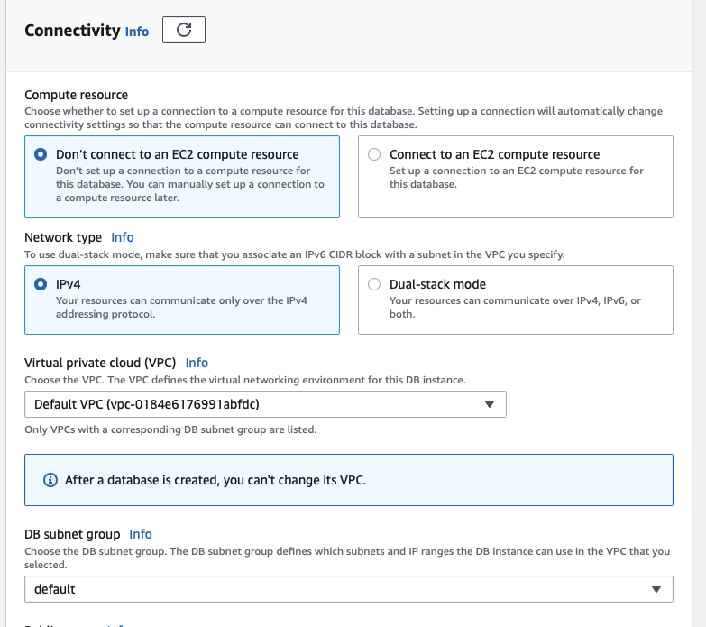

# RDS Lab instructions

## Description

This lab will cover:

- Creating an RDS instance

- Connect to the RDS instance from local machine

## Pre-requisites

- Access to an AWS Account

- Docker or any MySQL client installed

## Instructions

Type RDS in the search bar to look for the RDS console

Click on DB Instances and in create database

The RDS console provides an "easy create" method to use a recommended set of configurations and help the users with the technical details. This time we are going to use the standard create.

We have 7 option for the engine of our database instance. This includes some of the mostly used in the industry along with AWS offering, AWS Aurora with compatibility with MySQL and PostgreSQL.

Choose an option for engine type and version.

Next is the __templates__ section. To make this process easier, we have templates with suggested configurations to meet the type of requirement that we want to cover.

Depending on the option that we choose, the configurations and options below are going to change, for example, If we select the "free tier" it will disable the Milti-AZ configurations since those options have a cost.

[database templates](./images/database-templates.png)

We are selecting the free tier this time.

In the settings section, type an identifier to the instance. Note, this is not the name of the database.

We have the option to set the master user and password to access the database, or handle this using secrets manager. We are not exploring secrets manager this time so set your own user and password here.

From the instance configuration, note that only a few are available to select, since we have chosen the free tier. We can leave db.t3.micro for testing purposes.

In the storage section, we just leave it as default, since we are not requiring a lot just for testing. We can find here the a similar storage configuration as EC2 since it is the technology powering our DB isntances.

In the connectivity section, we are going to configure the network where the instance is being deployed. Since this is running in an EC2, we need to deploy in a VPC, with an specific subnet and security group.

First we get the option to configure our database to receive connections from an existing EC2. This is useful when your allplications will run in that other EC2 instance and you require to connect to this database. Leave the default values, we don't need connection to other EC2 but we can just dpeloy in the default VPC and subnet (__not recommended for real environments__).

On Public access, we are setting it to "yes" this is not usually done for real environments and it is not the best security practice. We need to set it public to connect from the internet for this demo, If we set it to private AWS wil not provision a public IP that we can reach.

For the sake of simplicity in the demo, we can levae it in a default security group, we will need to open the ports. Other advanced options like RDS proxy or certificates will not be required,

Next, leave password authentication selected, and you are good to go.

The provisioning of our isntance will start and will take a few minutes. In the meantime, If you haven't used the default security group and you don't have the rule to connect to the database, let's take a look at the security group.

Once redirected to the Database table, select the one you just created and scroll down to the security group rules.

Since we use the default one, there will be no rules there. We need to allow the connection to MySQL default port

Check the Connectivity & security section above and look for the VPC security groups. Click on the security group id.

This will take you to the security groups in the EC2 console. Go to the tab below and click on __inbound rules__, and in the right-hand side, click on a button to __Edit inbound rules__. Add a new rule with these details

- __Type__: TCP

- __Port range__: 3306

- __Source__: Anywhere IPv4

Save the rules.

Back on the RDS console, validate the instance is up and running and open the detauls again.

In the Connectiovity & Security section, we can find the information to connect to the database, so save the __endpoint__ and __port__

You can use this to connect from your prefered local client. If you don't have any installed, but you have Docker, you can use the mysql Docker image following the instructions [here](https://hub.docker.com/_/mysql).
