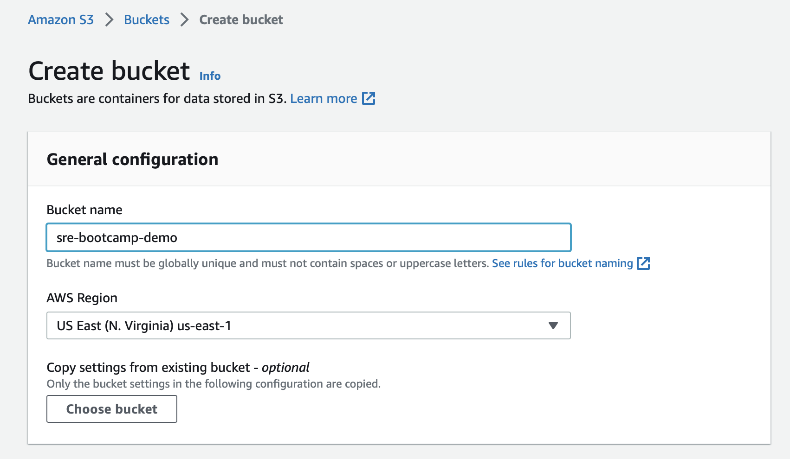
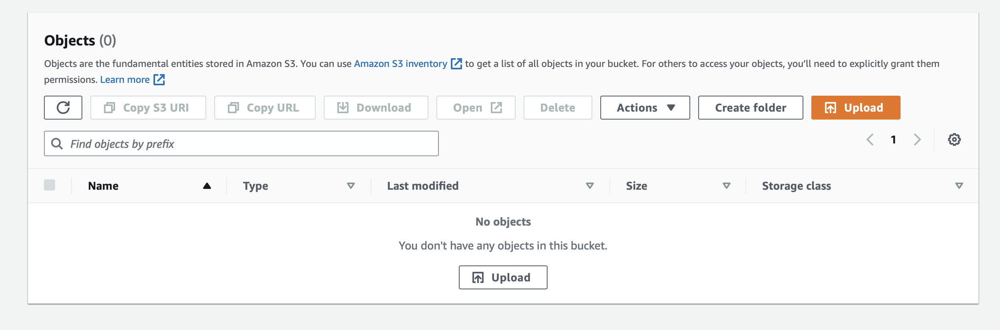
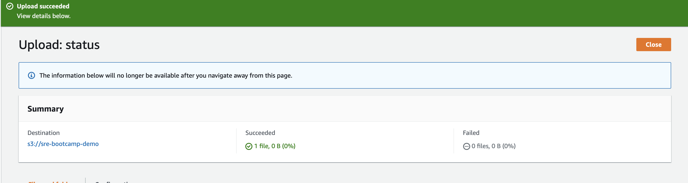
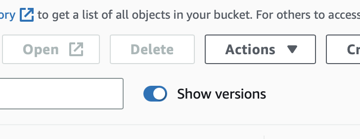
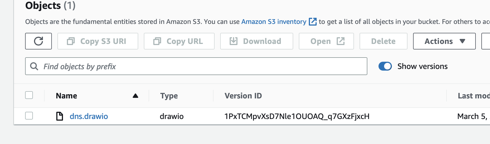
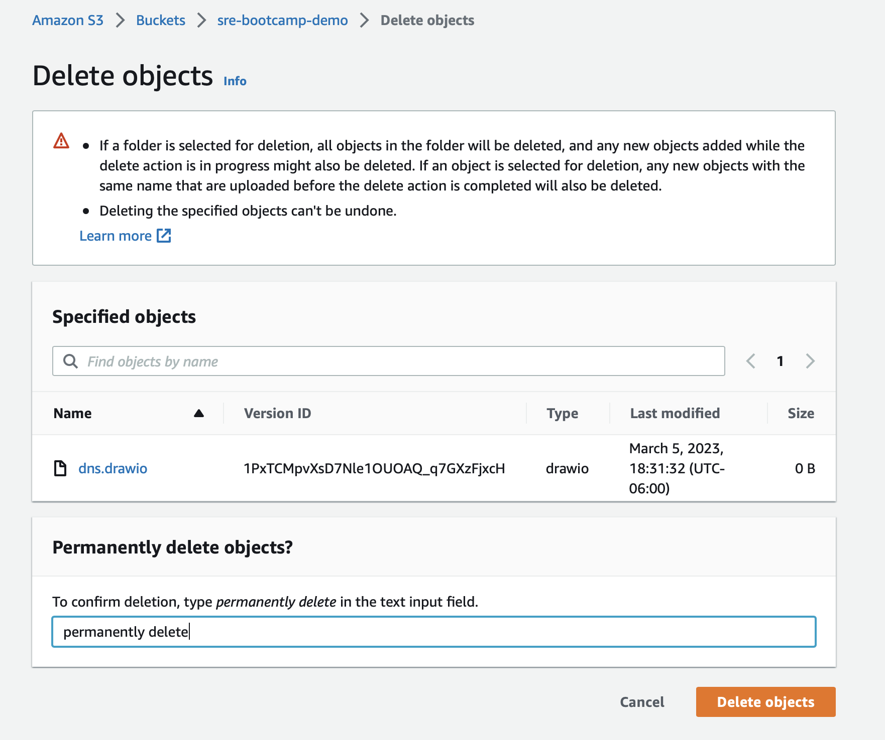
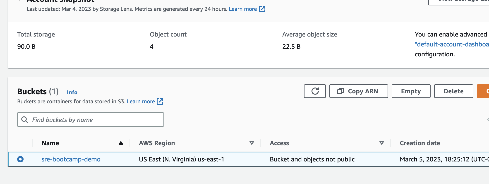
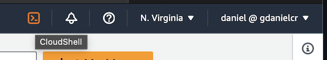

# S3 Demo instructions

## Description

This demo will cover:

- Creating an S3 bucket from AWS CloudShell/AWS CLI and from the AWS Console

- Visualizing S3 resources and content form the AWS console and the CLI/Cloudshell

- Show an example architecture using the AWS S3 services.

## Pre-requisites

- Access to an AWS Account

- AWS CLI installed and configured or access to AWS Cloudshell

## Instructions

### Provision and manage S3 buckets through the AWS S3 Console

Login to your AWS Account and navigate to the S3 console. Click on create bucket.



The bucket name must be unique, write a valid name and scroll down. Click on create, leave all other options as default.

After this the bucket will be created and you will be redirected to the list of all your buckets. Click in the new bucket that you've created. The bucket should be empty.



Click in upload and select any file from your local machine. Take a look at the different configurations, you have the option even to enable bucket versioning



Close the successful message and it will redirect again to the bucket object list. Enable "Show Versions" to see the Version ID



If you have enabled the versioning you should be able to see the ID, if not, you will only see "null".



Select the object to see the properties. Click on delete to remove the object from the bucket. Confirm deletion in the next window.



Navidate to the bucket list, select the bucket and click on delete



### Create and view S3 buckets using AWS CLI

If you have installed the AWS CLI, open a new terminal, If not, you can use AWS Cloudshell.

Login the AWS Console and look for the CloudShell icon near the account information in the upper right corner



If you rather install and configure the AWS CLI in your machine, follow the steps in the [AWS documentation](https://docs.aws.amazon.com/cli/latest/userguide/getting-started-install.html), but don't forget to also setup your credentials as described in this [other documentation](https://docs.aws.amazon.com/cli/latest/userguide/getting-started-quickstart.html)

Either If you have opened a session in AWS Cloudshell or your local machine terminal, the commands in these steps will work the same.

To manage S3 buckets using the CLI, we have the [s3 command](https://awscli.amazonaws.com/v2/documentation/api/latest/reference/s3/index.html)

To create a new bucket, run the below command, where `{BUCKET_NAME}` is the name of your bucket:

```bash
aws s3 mb s3://{BUCKET_NAME} --region us-east-1
```

> __Note:__ Remember that the bucket namespace is shared by all users of the system, so it has to be unique.

You should see a response like `make_bucket: {BUCKET_NAME}`.

Run the below command to list all the buckets in the account and confirm it was created successfully

```bash
aws s3 ls
aws s3 ls s3://{BUCKET_NAME}
```

You should be getting the bucket from the first command and an empty response in the second one.

Next, create a sample file in the terminal and copy it to the bucket.

```bash
touch test.txt
Aws s3 cp test.txt s3://{BUCKET_NAME}
```

List again the content of the bucket, adding flags to make the output more readable

```bash
 aws s3 ls s3://{BUCKET_NAME} \
  --recursive --human-readable --summarize
```

We could also enable bucket versioning from the CLI using the command below.

```bash
aws s3api put-bucket-versioning \
  --bucket {BUCKET_NAME} \
  --versioning-configuration Status=Enabled
```

Modify the content of the test file and copy it again a couple times to the bucket to create a few other versions

```bash
echo "some other text" > test.txt
Aws s3 cp test.txt s3://{BUCKET_NAME}
```

To list all object versions

```bash
aws s3api list-object-versions --bucket {BUCKET_NAME} --prefix test.txt
```

Now you can validate these changes and the different versions of the file from the AWS Console as well, explore the file created.

To delete all versioned objects in an S3 bucket with versioning enabled, you have to run the __aws s3api delete-objects__

```bash
aws s3api delete-objects \
  --bucket {BUCKET_NAME} \
  --delete "$(aws s3api list-object-versions \
    --bucket {BUCKET_NAME} \
    --output=json \
    --query='{Objects: Versions[].{Key:Key,VersionId:VersionId}}')"
```

To validate If versioning is enabled in the bucket execute

```bash
aws s3api get-bucket-versioning --bucket
```

Disable object versioning in the bucket

```bash
aws s3api put-bucket-versioning \
  --bucket {BUCKET_NAME} \
  --versioning-configuration Status=Suspended
```

Run the delete command again but this time, retrieve the list of objects with a delete marker and delete them so the bucket is empty.

```bash
aws s3api delete-objects \
  --bucket {BUCKET_NAME}   \
  --delete  "$(aws s3api list-object-versions \
    --bucket {BUCKET_NAME} \
    --output=json \
    --query='{Objects: DeleteMarkers[].{Key:Key,VersionId:VersionId}}')"
```

Now that the bucket is really empty we can run the delete command

```bash
aws s3 rb s3://{BUCKET_NAME}
```
